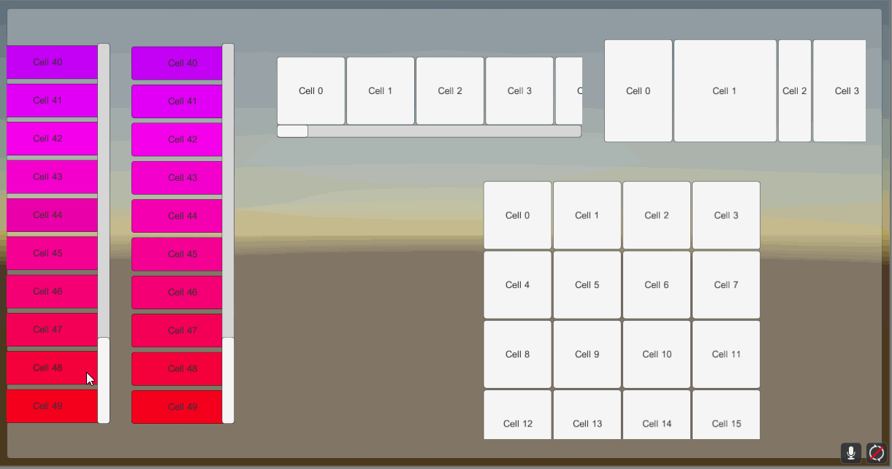
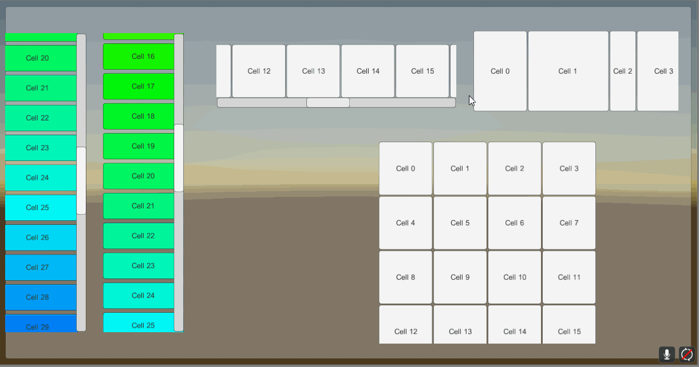
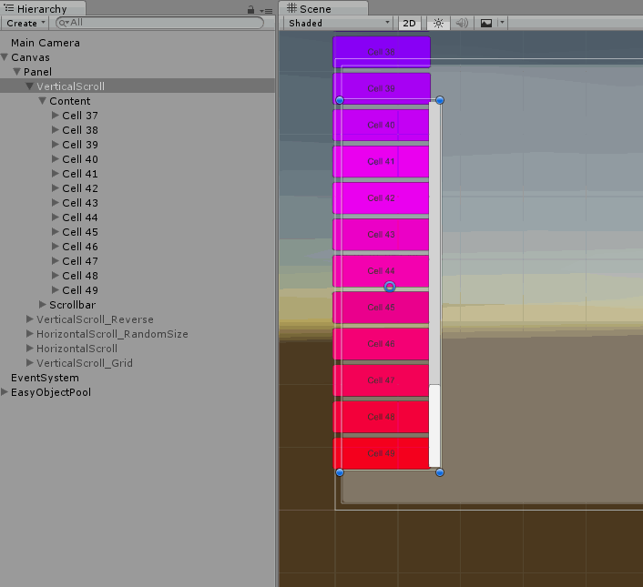
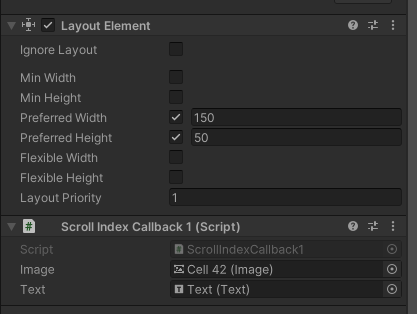
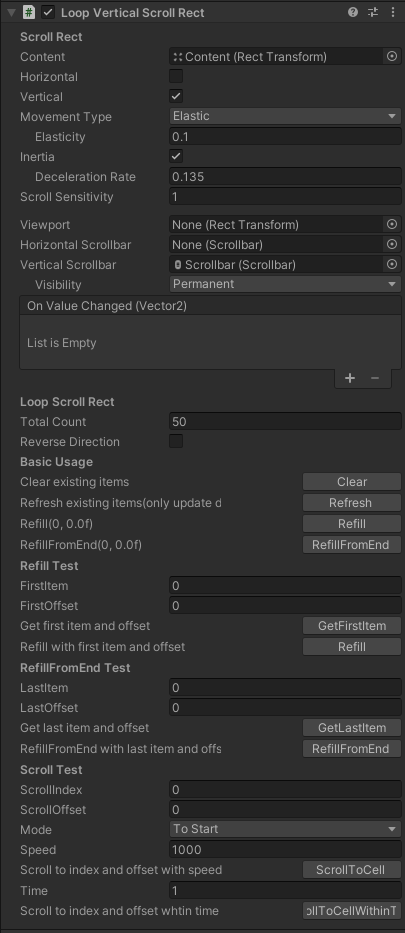

# Loop Scroll Rect

These scripts help make your ScrollRect `Reusable`, because it will only build cells when needed. If you have a large number of cells in a scroll rect, you absolutely need it! It will save a lot of time loading and draw call, along with memory in use, while still working smoothly.

中文说明请看[这里](http://qiankanglai.me/2015/08/15/LoopScrollRect/)。

## Installation

`openupm add me.qiankanglai.loopscrollrect` with [OpenUPM](https://openupm.com/), or open Package Manager and Add package from git URL `https://github.com/qiankanglai/LoopScrollRect.git`.

## Demo Scene

Please refer to `DemoScene` for quick startup.

LoopScrollRect with mask disabled.

More complex example can be found in `DemoScene_MultiCell`.

`DemoSceneSingle` tests LoopScrollRects which are not fully filled.

## Quick Start

Please refer to `InitOnStart.cs` for simplest example usage:
- Implementing `LoopScrollPrefabSource` for providing different cells, and it's high recommended for using cache pool.
- Implementing `LoopScrollDataSource` for providing data for specified cell.

Also refer to `SizeHelper.cs` if you are using cells with different sizes:
- Implementing `LoopScrollSizeHelper` for providing precise cell sizes.

### Cell setup

The cell needs preferred width&height in Layout Properties when calculating layout. The easiest way is attaching `Layout Element` and setting preferred width&height.

Also cell needs to be attached with script receiving `void ScrollCellIndex (int idx)`.

## Inspector & API

Apart from implementing interfaces above, other staffs are provided in Inspector for quick test.

- **Total Count**: How many cells in total? Negative number means infinity.
- **Reverse Direction**: If you need scrolling from down to top(vertical) or right to left(horizontal), enable this and adjust Content's pivot&Anchor.

- **Basic Usage**
    - **Clear**: Clear existing items and set total count to zero.
    - **Refresh**: Refresh existing items without effecting layout. All cells only get data updated for performance concern.
    - **Refill**: Clear and refill items from start. Layout is recalculated fully.
    - **RefillFromEnd**: Clear and refill items from end. Layout is recalculated fully.
- **Refill Test**
    - **GetFirstItem**: Get the first visible item index and offset
    - **Refill**: Clear and refill items from start, using specified first item and offset.
- **RefillFromEnd Test**
    - **GetLastItem**: Get the last visible item index and offset
    - **RefillFromEnd**: Clear and refill items from end, using specified last item and offset.
- **Scroll Test**
    - **ScrollToCell**: Scroll to specified item and offset with speed
    - **ScrollToCellWithinTime**: Scroll to specified item and offset in time
